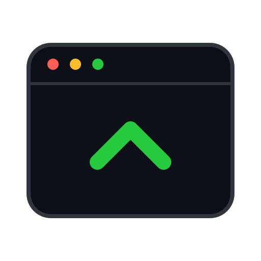

  

<h1 align="center">NanoHarness</h1>

  <strong>The AI coding harness that improves and fixes itself.</strong>

  
  
  =20">
  
  
  

NanoHarness is a small, token-efficient, self-documenting coding harness, and the agent can edit it. When something breaks or could work better, the harness changes its own source. Every self-edit goes through user review, tests, and safe mode, so nothing changes unless you approve it.

## What makes it different

- The agent edits its own source to fix bugs and improve how the harness works. You review and test each change before it applies.
- Every source file starts with a `// doc: docs/harness/<area>.md` header, and every doc lists its files. The codebase explains itself.
- Works with any OpenAI-compatible API, and with Anthropic's own, including its signed thinking blocks.

## Permissions

A session's tools are scoped to the folder it was started in. Work inside that
folder runs; anything reaching outside it, and every shell command, has to be
approved. You answer those questions one of two ways, switched per session from
the chip in the header:

- **ask every time** (the default) — the turn stops and waits for you.
- **auto-approve** — a second model of your choosing reads the action and
  answers allow or deny. It decides; it never hands the question back, so a
  task can run for an hour while you are away without stopping on a dialog two
  minutes after you leave. Where it is unsure it denies, and the run carries on.
  It cannot be turned on until you have chosen that model in Settings. If that
  model cannot be reached at all, after retries, the question comes to you
  rather than being guessed either way.

What it costs is counted apart from the conversation, and every automatic
decision is written to a log beside the transcript.

**This is a check, not a sandbox.** An approved shell command runs with
everything your own account can reach; there is no filesystem or network
containment. [SECURITY.md](SECURITY.md) sets out what that does and does not
protect you from, and [docs/harness/approval.md](docs/harness/approval.md) has
the design.

## Status

Early, active development. The specification and build order are in
[plan.md](plan.md) (section 17). Research notes live in
[docs/research/](docs/research).

## Development

Requires Node 20+ and pnpm 11.

    pnpm install
    pnpm typecheck
    pnpm lint
    pnpm test

## Community

- [Contribute](CONTRIBUTING.md). PRs welcome; commits follow Conventional Commits.
- [Discussions](https://github.com/balegabme/nanoharness/discussions) for questions and design ideas.
- [Code of Conduct](CODE_OF_CONDUCT.md)
- [Security](SECURITY.md): report vulnerabilities privately.

## License

[Apache-2.0](LICENSE)
