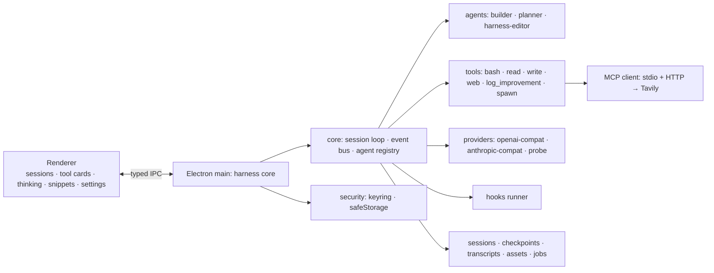

# NanoHarness — Plan (v0.4)

Minimal, opinionated coding harness whose twin obsessions are **token efficiency** and
**self-documentation**: every code file points to the md doc that explains it, so any agent
(or the user) can navigate the harness instantly and modify it safely. Distributed as an
**open-source GitHub repo** — hygiene rules in §16.

**Status:** planning complete — **all research answered** (§17). Ready to build (§18).

**Intent (why this exists):** distilled from years of daily use of Claude Code, opencode,
pi, oh-my-pi, deepseek harness and others — each had strengths the others lacked. This is
the personal synthesis, purpose-built for coding: minimal codebase, maximal token
efficiency, self-knowledge via the doc map, and a self-improvement loop.

---

## 1. Vision & non-goals

**Vision.** A small desktop app that runs multiple agent sessions across multiple folders,
with three agents (builder / planner / harness-editor), a handful of tools (bash, read,
write, web search/fetch via Tavily MCP), MCP + skills support, minimal lifecycle hooks,
prompt snippets, and a self-improvement loop: friction hit while coding gets logged to an
improvement md and fixed by a background harness-editor subagent on user approval.

**Non-goals (v1).** No git UI, no extension marketplace, no multi-user/remote serving, no
RAG/indexing infra. "Minimal" means minimal *codebase and token spend*, not runtime footprint.

---

## 2. Locked decisions

| Decision | Choice |
|---|---|
| Language/runtime | TypeScript on Node (Bun-compatible source) |
| License | Apache-2.0 (patent grant, contribution-friendly; MIT acceptable if preferred) |
| Distribution | GitHub repo + npm package (core + `nh` CLI); tagged releases also publish desktop installers (electron-builder: NSIS + portable exe, dmg, AppImage) |
| UI | Desktop app (**Electron**): harness core in the main process (pure TS — no sidecar, no second language); renderer = local web view over typed IPC. **No HTTP listener in v1** |
| Design language | Own cozy-professional system — **dark-only** (no light theme), warm grays, accent, mono-first, keyboard-first (§13). The Claude Code report is an ergonomics reference only, not a visual spec to copy |
| Agents | 3 roles: **builder** (write), **planner** (no write), **harness-editor** (doc-fed). No rigid orchestration: any agent may summon the others as subagents; user can switch the session's active agent mid-session |
| Docs mechanic | docs/harness/*.md = feature documentation; every source file header links to its doc; docs link back to files. Navigation layer, kept in sync |
| Flaw loop | Agents append friction (tool errors, things not working, too-many-tool-calls) to an improvement md via a dedicated tool; surfaced in final answer; on "fix" → harness-editor subagent runs in background |
| Snippets | Prompt snippets with frontmatter (`name`/`description`/`placement: prepend\|append`/`order`), insertable into the composer via popup picker (§9) |
| Hooks | Minimal lifecycle set: `PreToolUse`, `PostToolUse`, `Stop`, `SessionStart` — shell commands, JSON on stdin, exit code/JSON can block or annotate |
| Providers | OpenAI-compatible + Anthropic-compatible. Provider = {name, kind, baseURL, apiKey}. Keys in OS credential store. Test button pulls models + capability-aware warnings (§11) |
| Transcripts | JSONL per session, stored in OS user-data dir (never in the repo); resumable |

---

## 3. Architecture



**Modularity backbone = the event bus.** Everything the core does is emitted as a typed
event; the UI is just a renderer of events. New tools/agents/hooks are new event sources —
nothing else changes.

Events (v1): `session_*`, `agent_switch`, `prompt_injection` (stage name + content + token
estimate — every system-prompt section injection is visible), `tool_call`, `tool_result`,
`thinking_delta`, `text_delta`, `job_update` (background subagent progress), `usage`
(per-turn token accounting incl. cached-token fields), `checkpoint`, `steering`.

---

## 4. Repo layout & the doc map (the core mechanic)

```
nanoharness/
  README.md  LICENSE  CONTRIBUTING.md  SECURITY.md  CODE_OF_CONDUCT.md  CHANGELOG.md
  .github/workflows/ci.yml   .gitignore   .editorconfig
  docs/
    harness/              # one md per feature area — the documentation layer
      overview.md         # architecture, data flow        ← src/core, src/main
      doc-map.md          # this convention itself + index
      agents.md           # agent defs, prompts, permissions ← src/agents
      tools.md            # tool specs                      ← src/tools
      providers.md        # provider layer, auth, probing   ← src/providers
      mcp.md              # MCP client, Tavily wiring       ← src/mcp
      skills.md           # skill format + injection        ← src/skills
      snippets.md         # snippet format + composer flow  ← src/snippets, src/renderer
      hooks.md            # hook events + config            ← src/hooks
      sessions.md         # session model, transcripts, checkpoints ← src/sessions, src/store
      env-detection.md    # system probe + prompt injection ← src/env
      ui.md               # desktop UI: events, components, design tokens ← src/renderer
      security.md         # key storage                     ← src/security
      improvements.md     # THE flaw/improvement ledger (living doc)
    research/             # deep-research artifacts (source material, not doc-map targets)
  snippets/               # built-in prompt snippets shipped with the package (secret-free)
  examples/               # sample skill, hooks.json, mcp.json, commands/ — secret-free
  src/
    main/     core/   agents/   tools/   providers/   snippets/
    mcp/      skills/ hooks/    env/     security/    renderer/
```

Doc-map rules:
1. **Every source file's first lines**: `// doc: docs/harness/<file>.md` (+ optional `#anchor`).
2. **Every doc lists its files** under a `Files:` heading — bidirectional links.
3. `nh doc-check` (command + SessionStart hook): fails on files without doc links, docs
   without files, dead links. Zero discipline required to keep the map honest.
4. **Harness-editor context**: at spawn it receives the doc *index* (list mode: path +
   one-line summary per md), reads what it needs, then edits code. List-first,
   read-on-demand — itself a token-efficiency technique.
5. Improvement entries land under dated headings in the workspace ledger
   `.nanoharness/improvements.md`; when the workspace *is* the nanoharness repo (dev mode)
   they land in `docs/harness/improvements.md` instead — the installed package dir is never
   written to. The harness-editor marks entries resolved (with ref) when fixed.

Per-project config lives in `.nanoharness/` (workspace): model choice, hooks.json,
mcp.json, skills/, commands/, snippets/, memory file. Secret-free by schema (§16).

---

## 5. Agents

One active agent per session at a time; user-switchable mid-session (transcript preserved).
Any agent may summon the others as subagents via `spawn`; subagents return a compressed
summary + artifacts.

| | builder | planner | harness-editor |
|---|---|---|---|
| Purpose | regular coding on the project | read-only research/planning | modifies the harness itself |
| Write tools | bash, read, write | read, bash (guarded) | bash, read, write |
| Bash | full, cwd-scoped | best-effort write-guard (deny `>` `>>` `tee` `rm` `mv` `cp` `sed -i` …; pwsh variant when the §6 fallback is active: `Out-File`, `Set-Content`, `Remove-Item`, `Move-Item`, `Copy-Item` …) — documented as best-effort, not a security boundary | full, harness-repo-scoped |
| Extra context | env block | env block | **doc index list** + improvements.md |
| Default effort | low/medium | medium/high | low |

**Delegation patterns (research §4 — modes adopted; the ~10% clone rate and 15× inflation
figures are single-source defaults to re-measure on our eval mix):** three spawn modes, ranked by cost:
1. **Distinct subagent** (own system prompt/tools) — full uncached price; only when
   isolation is essential (harness-editor jobs).
2. **Cache-sharing clone** (inherits parent's exact prompt/tools/history bytes) — clones 2..N
   hit the parent's cache at ~10% rate; 5 parallel clones ≈ 5× faster at ~1.5× cost.
3. **Stay in main loop** — cheapest; mandatory default for tightly sequential work
   (breaking sequential work into subagents inflates cost up to 15× with zero benefit).

Worker subagents route to a cheaper model by default (~5× $-cost lever, research §4).

**Improvement flow.** Agent hits friction (tool call errors, something not working,
noticeably too many tool calls) → `log_improvement` appends a dated entry → final answer
lists found issues + "fix?" → user confirms → harness-editor subagent starts **in the
background**, consumes ledger entries, edits code + docs, runs `doc-check`/typecheck,
reports back via `job_update`. Never runs `git commit`/`push`/`tag` — it returns suggested
commits (§16). UI shows the job live.

---

## 6. Tools (v1)

- **bash** — cwd-scoped shell, timeout, output captured + truncated with **explicit** elision
  markers (never silent truncation — research counter-evidence §10). **Windows:** drives Git
  Bash when detected (`bash.exe` from Git for Windows → real coreutils); falls back to
  PowerShell 7. The shell choice comes from the §12 env probe and is injected so the model
  knows which dialect it is writing.
- **read** — offset/limit with caps (2,000 lines / 2,000 chars per line, 256KB pre-read
  gate); past the gate → explicit error with continuation hint, not silent truncation.
  Structural summary first; grep-first exploration encouraged.
- **write** — create/overwrite; **str_replace-style narrow patches as default** (3.5–6.5×
  cheaper than sequential edits, 6× cheaper than full rewrites; full rewrite only under
  ~300–400 lines). Snapshot tags `{path: hash}` after writes to avoid confirm re-reads;
  revalidate hash/mtime before trusting (external formatters invalidate).
- **web_search / web_fetch** — routed through the Tavily MCP server (built-in default MCP
  config). If Tavily unavailable → clear error, no silent fallback.
- **log_improvement** — appends a dated entry to the workspace improvement ledger (§4 rule 5). All agents.
- **spawn** — summon subagent (name, prompt, scope, mode: distinct/clone); background option.
- **Parallel dispatch** — harness executes independent tool calls in one turn concurrently
  (research: batching cut input tokens ~60%, latency 4×).
- **Images**: not a tool — user pastes/drags in UI → session assets dir → rendered in chat →
  base64 content blocks to vision-capable models. Auto-downscale toggle (§15).

---

## 7. MCP client (spec: `docs/research/mcp-client-spec.md`)

**Protocol subset (tools-only v1, spec-compliant):**
- Transports: **stdio** (NDJSON on stdin/stdout; stderr = opaque logs, never an error
  signal) and **Streamable HTTP** (single endpoint, POST with
  `Accept: application/json, text/event-stream`; server may upgrade to SSE).
- Lifecycle: `initialize` **must be the first message and never batched** → negotiate
  `protocolVersion` (send latest, accept server's or disconnect) → `notifications/initialized`.
- Discovery: `tools/list` (cursor pagination); honor `notifications/tools/list_changed` by
  re-fetching — never cache the catalog indefinitely.
- Invocation: `tools/call` → `CallToolResult` (`content[]`, `isError`, `structuredContent`).
- Cancellation: advisory `notifications/cancelled` with `requestId`; ignore late responses
  for a cancelled id; **client-side deadline per outstanding request id** —
  `REQUEST_TIMEOUT` distinct from `CONNECTION_CLOSED`.
- Auth (HTTP only): `Authorization: Bearer` header on every request — **never** in the query
  string. v1 = static bearer; OAuth 2.1 + PKCE only on a 401
  `WWW-Authenticate: Bearer resource_metadata=…` challenge. stdio creds from env.
- Reconnect: dropped Streamable HTTP session (stateful, `Mcp-Session-Id`) → full
  re-`initialize`.

**Windows spawn strategy:** branch on `process.platform`; on win32 wrap
`cmd /c npx -y <pkg>` (direct `spawn("npx")` = ENOENT — it's a `.cmd` script),
`windowsHide: true`, absolute paths via `where`; prefer `uvx` for Python servers.

**Schema translation (MCP → provider):**
- OpenAI: `{"type":"function","function":{name, description, parameters: inputSchema}}`.
  Args return as a **JSON string** — harness parses. `strict: true` requires
  `additionalProperties: false` + all properties in `required` → post-process MCP schemas.
- Anthropic: `{name, description, input_schema: inputSchema}`. Args arrive pre-parsed.
- Results: MCP `isError` → Anthropic `tool_result.is_error`; OpenAI `role:"tool"` message
  with plain-text failure. MCP image content blocks → Anthropic multi-block
  `tool_result.content`.

**Error/retry policy:** protocol errors (`-32700…-32603`) are harness bugs — model never
sees them; tool-domain failures (`isError: true`) go to the model for self-correction. No
retry on `-3260x` without changing the request; bounded transient retry (2–3, fresh id,
backoff); then surface final `isError`.

**Tool naming:** MCP tools are exposed to models as `mcp__<server>__<tool>` — no collisions
with built-in tools or across servers, and the prefix is stable so tool-set bytes stay
cache-safe.

---

## 8. Skills

Claude-style, minimal: folder with `SKILL.md` (name, description, trigger hints). Injection
= **list of name + one-line description only**; agent reads full skill on demand.
Progressive disclosure = token discipline.

---

## 9. Prompt snippets

Reusable steering directives inserted into the **user's message** at compose time — never
the system prompt, so they're cache-safe and per-message deliberate.

**Format** (md file + frontmatter — exactly the six files in `docs/research/snippets/`,
which become the shipped defaults):

```markdown
---
name: Session kickoff
description: Get oriented, report back before starting work
placement: prepend      # or: append
order: 10               # picker sort order
---
Familiarize yourself with this project before we start. Once you have a clear
picture, report back. Do not begin any work until we have aligned on what's next.
```

Built-in defaults (ship in repo `snippets/`): `session-kickoff`, `orchestrator-mode`,
`verify-not-assume`, `ask-questions`, `delegate-exploration`, `diagnose-report`.

**Locations & merge:** built-in (package) → user-global (user-data dir) → project
(`.nanoharness/snippets/`); later layers override by filename; picker sorted by `order`.

**Composer flow (UI):** a snippets button + keyboard shortcut opens a filterable popup
(name + description + placement badge). Selecting inserts the snippet into the composer:
`prepend` snippets render as a distinct block **above** the draft with a subtle divider
chip, `append` below — both **fully editable inline after insertion**, removable via chip ×.
Multiple snippets stack. A live preview shows the final assembled message
(prepend(s) + user text + append(s)) exactly as it will be sent. Cozy and flawless: no
modal traps, esc closes the picker, insertion never moves the caret out of the draft.

**Semantics:** pure user-message text; zero system-prompt churn; adds tokens by design
(steering directives) — the UI shows the added-token estimate per snippet so the cost is
visible before sending. Estimate = chars/4 heuristic everywhere (Anthropic-only refinement
via `count_tokens` isn't worth the extra round-trip).

---

## 10. Hooks

Config: project or global `hooks.json`. Events: `PreToolUse`, `PostToolUse`, `Stop`,
`SessionStart`. Runner spawns shell command, pipes JSON (event + payload) on stdin; exit
code 2 = block, stdout JSON = annotate/modify (inject context, file a flaw). `doc-check`
runs as a SessionStart hook by default.

---

## 11. Providers & settings

Full reference: `docs/research/OpenAI vs Anthropic API Schema Reference.md`
(integration checklists + quirk matrix).

**Wire essentials:**
- OpenAI: `POST /v1/chat/completions` (v1 target; `/v1/responses` = later migration,
  flat tool schema + typed events), `Authorization: Bearer`; models via `GET /v1/models`
  (`data[].id`).
- Anthropic: `POST /v1/messages` (`model`, **`max_tokens` required**, `messages[]`, system
  is top-level, never a message), headers `x-api-key` + `anthropic-version: 2023-06-01`
  (+ `anthropic-beta` for opt-ins); models via `GET /v1/models` **which returns per-model
  `capabilities`** (thinking, effort levels, image input) → the test button reads this
  directly for anthropic-compat; probing stays for openai-compat.
- Streaming: OpenAI untyped `chat.completion.chunk` deltas + literal `data: [DONE]`
  sentinel; tool-call args stream as JSON-string fragments indexed by call, concatenated
  then parsed once. Anthropic named events `message_start → content_block_* →
  message_delta → message_stop` (+ `ping`/`error` anywhere); deltas: `text_delta`,
  `input_json_delta.partial_json` (concatenate, parse at `content_block_stop`),
  `thinking_delta`, `signature_delta`.
- Reasoning: OpenAI `reasoning_effort` values **vary by family**
  (`none|minimal|low|medium|high|xhigh|max`; o1-mini has none) — maintain a per-model
  allow-list; invalid values 400 or silently drop. Anthropic
  `thinking: {type:"enabled", budget_tokens: N}` with **N ≥ 1,024 and N < max_tokens**
  (interleaved-thinking lifts the ceiling to the context window). Effort
  `none|low|medium|high` → `reasoning_effort` / budget (0 / 4k / 16k / 32k, clamped).
- Usage fields: OpenAI `usage.prompt_tokens_details.cached_tokens` +
  `completion_tokens_details.reasoning_tokens`; Anthropic
  `usage.cache_creation_input_tokens` + `cache_read_input_tokens` (+ ephemeral 5m/1h split).
  Both-cache-fields-zero = below minimum cacheable length → surface as info, not error.
- `POST /v1/messages/count_tokens` available for pre-flight context math (Anthropic).

**Provider record:** `{name, kind, baseURL, apiKey}`. Keys → OS keyring (Windows Credential
Manager / macOS Keychain / libsecret; encrypted-file fallback).

**Test button:** `GET {base}/v1/models` → model list → capability check per selected model
(Anthropic: from `capabilities`; OpenAI-compat: 1-token probe calls) → UI warnings:
"no effort levels for this model", "no vision", "no tool use". Missing `/v1/models` on a
proxy → fallback probe.

**Third-party quirk highlights (full matrix in the report):** Groq — **no image input at
all**, 400s on `logprobs`/`n≠1`/`messages[].name`, silently drops `prompt_cache_key`/
`store`; Ollama — no image URLs (must base64), **no `tool_choice`**; vLLM — reasoning and
tool parsing need **server-side flags**, not request params; Together — silently ignores
`service_tier`/`store`/`metadata`; OpenRouter — normalizes to its own `reasoning` object.
Practical trap: never assume `reasoning_effort` or `tool_choice` are portable.

**Provider retry policy:** exponential backoff + jitter on 429/5xx (honor `Retry-After`),
bounded retries per turn, then a user-visible error — never silent degradation.

**Settings surface:** providers list (+test), default model + effort, per-agent
model/effort, MCP servers, skills dir, snippets dirs, hooks on/off, image auto-downscale.

---

## 12. Environment detection & prompt injection

One-time probe at session start (cached, stable): OS/arch/kernel, shell (bash/pwsh/cmd),
coreutils vs BSD utils, git, node/bun/python availability, package managers, ripgrep/fd
presence. Injected as a compact block.

**Cache rule (the #1 cost lever — research §1):** provider caches are strict **byte-prefix**
matches. Classify every prompt input by stability — never-changes / per-session / per-turn /
per-request — and place volatile fields strictly after the last cache breakpoint. Tools
render first (tools → system → messages), so: **the session's tool set is frozen at session
start**; no timestamps/UUIDs in the prefix; append-only messages. Anthropic: up to 4
explicit `cache_control` breakpoints, 20-block lookback, TTL 5 min (refreshed on hit; 1 h
at 2× write cost). OpenAI: automatic ≥1,024 tokens, 128-token increments, evicted 5–10 min
idle (gpt-5.1+ non-ZDR orgs: 24 h).

Every prompt assembly stage emits a `prompt_injection` event → collapsible cards in the UI.

---

## 13. UI (desktop app) & design system

**Reference, not spec:** `docs/research/Claude Code Visual & Interaction Design Spec for Web
Port.md` (~65% confidence) is consulted for *interaction ergonomics only* — keyboard map,
queueing semantics, permission-dialog pattern, component behavior. The visual identity is
ours: an original cozy-professional token set defined in `docs/harness/ui.md`. No
color-for-color, type-for-type, or asset reproduction of Claude Code; no mirroring of its
token names.

**Shell: Electron.** Harness core runs in the main process (pure TS — direct Node `fs` /
`child_process` for bash + MCP stdio, no sidecar process). Renderer = plain TS + minimal
view layer; the same event-bus payloads stream over typed IPC channels. **No HTTP listener
in v1** — the CSRF / DNS-rebinding class against a shell-executing localhost server is
designed out. Electron hygiene: `contextIsolation: true`, `nodeIntegration: false`, no
remote content, CSP `default-src 'self'`. If a headless/server mode ever lands (v2+):
bind 127.0.0.1 only + startup-issued bearer token.

**Design tokens (initial values; live in `docs/harness/ui.md` as CSS variables — ours, tunable):**
- Palette: **dark-only** — our own warm-gray ramp; one accent in the warm
  orange-terracotta family (exact hex ours to tune, not copied).
  Semantic: `--success` / `--error` / `--warning` / `--muted` / `--subtle`. Diff pair
  `--diff-added-bg` / `--diff-removed-bg` + word-level highlights + dimmed rejected edits.
  Mode accents (borders): plan = blue, auto-accept = green, permission = teal, bash =
  accent. Per-subagent hue rotation for transcript tinting.
- Typography: `--font-mono` (system mono stack) is the primary chat/transcript face
  (~14px/1.5); `--font-sans` (system stack) for chrome; optional `--font-display` serif
  skin later. Weights 400/500/600/700.
- Spacing/radius: plain 4px base scale `4/8/12/16/24/32`; radius 6px cards, 4px chips;
  1px mode-tinted borders.
- Motion: short list (~12) of our own spinner verbs (customizable) + accent→shimmer
  keyframes ~120–200ms, verb crossfade 2–3s.

**Components (ergonomics adopted, visuals ours):** assistant/user message blocks (labels,
markdown, syntax highlighting); tool-call cards (one-line collapsed, expand for full I/O +
timestamp + model); thinking block (streams live → collapses to one-line chip, expandable);
todo widget; permission modal (**Yes / Yes-don't-ask-again / No** + `Tab` comment field);
diff view (inline word/line + dedicated per-turn/file viewer); slash-command menu;
status footer (model, folder, git branch, cost, context-% with green/yellow/red
thresholds, **live tps while streaming**); spinner; `[Image #N]` attachment chips with
thumbnail navigation; snippet picker + composer chips (§9); background job cards; usage
chips per turn (tokens, cost, cache-hit, tps). Tps = completion tokens ÷ streaming span
(first delta → last delta), derived renderer-side from existing `text_delta`/`usage`
events — no new API fields or events.

**Keyboard map (conventions worth keeping — familiarity is the feature):** `Esc` interrupt
(completed work preserved; queued messages dispatch next) · `Esc Esc` (empty input) rewind
menu — conversation only / code only / both · `Shift+Tab` cycle permission mode · `Ctrl+O`
verbose transcript · `Ctrl+T` todos · `Ctrl+B` background the task · `Ctrl+V` image chip ·
`Ctrl+J` newline · `Ctrl+X Enter` queue-submit · `Enter` submit · `Up` from first row
un-queues · `?` help · `@` path autocomplete · `/` command menu · `!` shell mode. Plus
`Ctrl+K` command palette on the desktop menu.

**Queueing semantics (documented behavior, adopted):** messages typed during a run queue
above the input; items sent during tool calls dispatch when those calls finish; at turn
end only the oldest queued message goes out; slash/shell commands wait for turn end.

**Layout:** left sidebar = sessions grouped by folder (+ new session → folder picker);
center = chat stream; agent selector + model/effort chips; settings modal (in-app window).

---

## 14. Feature backlog

**v1 (core experience):**
1. **Checkpoints + rewind** — file snapshot + conversation marker per turn; esc-esc menu
   (conversation only / code only / both).
2. **Diff-first edit review + permission modes** — every `write` = diff card
   (accept/reject); modes ask-edits / auto-accept / yolo, cycled with `Shift+Tab`.
3. **Live plan/todo artifact** — agent-maintained task list (plan-as-artifact) as widget.
4. **Interrupt + steering queue** — esc interrupts; typed messages queue and dispatch at
   tool-call boundaries (adopted semantics above).
5. **Session forking** — fork at any turn; prefix-preserving (cache hits).
6. **Slash commands + project memory** — `.nanoharness/commands/*.md`; project memory file,
   list-mode injected.
7. **Prompt snippets** (§9).
8. **Keyboard-first UI + command palette.**
9. **Cost dashboard** — per session/folder/day, cache-hit-rate time series (catches silent
   prefix drift), per-agent/phase attribution.

**v2 candidates:** model routing UI on top of default cheap-worker routing, LSP
diagnostics loop, background shells, transcript search, session export, opt-in headless
server mode (127.0.0.1 + startup-issued token), Responses-API migration.

---

## 15. Token efficiency — ranked plan (from `docs/research/Nanoharness Token-Saving Techniques Catalog.md`)

The report's **top-10, adopted as build priority**:

| # | Technique | Key numbers |
|---|---|---|
| 1 | **Cache-aware prompt assembly** — stability-classified inputs, stable byte-prefix, frozen per-session tool set, append-only messages; Anthropic ≤4 explicit breakpoints | 90% cache-read discount both providers (OpenAI newest families; legacy 50%); write 1.25×/2×; −80% latency on hits; **40–70% input-cost reduction on repeated-context turns** |
| 2 | **Usage instrumentation** — cache hit rate = `cache_read / (cache_read + input)`; per-agent/phase attribution; cost-per-task | Prerequisite for everything; catches silent cache breakage |
| 3 | **Offset/limit reads + explicit truncation markers + grep-first** | ~10× reduction on targeted lookups; silent truncation = documented hallucination bug class |
| 4 | **str_replace default edits**, full rewrite < ~300–400 lines | 3.5–6.5× vs alternatives (script 7K / diff 8.5K / sequential 25K / rewrite 43K tokens on the benchmark task) |
| 5 | **Batch independent tool calls** (system-prompt instruction + concurrent runner) | ~60% input reduction, 4× latency (12s→3s, 40K→16K) |
| 6 | **Effort tuning per role** (planner med/high, builder low/med, editor low) | low→med = best ROI (+9 pts acc for 2.5× tokens); high→xhigh = +1 pt for 2.3× — avoid |
| 7 | **Cheap-model routing for worker subagents** | ~5× $ reduction, biggest single dollar lever |
| 8 | **Microcompaction before full compaction** — time-based (keep recent N compactable tool results) or cache-aware (`cache_edits`-style strip without invalidating); compactable = read/bash/grep/glob/web/edit/write | Zero-API-cost tier; frees 20–40% working context on long sessions |
| 9 | **Progressive tool disclosure** — `defer_loading`-style + on-demand tool search, or code-execution wrapper for MCP (we have bash) | Tool-def tokens −85% (77K→8.7K); programmatic MCP measured 37–99.9% depending on setup; savings grow with catalog size (58% @96 tools → 93% @508) |
| 10 | **Compaction-exempt whitelist + eval-gated rollout** — never compact: pinned plan/todos, recent file reads, error state; validate every technique on our task mix | Prevents the state-loss failures that negate items 1–9 |

**Supporting specifics:**
- Full compaction: **v1 defers it entirely** — escape hatches are context headroom,
  microcompaction, and transcript resumability (restart with summary). v2 decides between
  Anthropic-native `context_management` compaction and our own tiers (micro → zero-cost
  session-memory → API-billed full; preserve system prompt + recent N + pinned). Academic
  validation band: 20–55% context reduction without accuracy loss (ACON, SWE-Pruner,
  Focus, TACO) — but only trust numbers from our own eval mix.
- Images: Anthropic `(w×h)/750` after ≤1568px fit (halving dims = 25% cost); OpenAI tiles
  (85+170/tile legacy; GPT-5.6+ patch-based `ceil(w/32)×ceil(h/32)×~1.2`); `detail:low` =
  flat 85; **OCR/text-extraction for text-heavy screenshots** (700–1,500 img tokens vs
  200–400 text).
- Delegation costs (§5 patterns): distinct subagents pay full uncached price; clones ~10%
  rate; sequential fan-out = up to 15× inflation.
- **Deprioritized (counter-evidence):** terse-output prompting — 65% headline vs ~8.5% on
  an 86-task replication. Per-request dynamic tool subsets — cache-thrash. Timestamps/UUIDs
  anywhere in prefix. Silent truncation of any tool output.

---

## 16. Open-source repo practices ("nothing leaked")

**Files (created at scaffold, step 0):** `LICENSE` (Apache-2.0), `README.md` (philosophy:
minimal + token-efficient; quickstart; doc-map explained), `CONTRIBUTING.md` (conventional
commits, PR flow, "every file needs a doc link" rule), `SECURITY.md` (key-handling
guarantees + private disclosure contact), `CODE_OF_CONDUCT.md`, `.github/workflows/ci.yml`,
`.gitignore`, `.editorconfig`, `CHANGELOG.md` (one entry per release), issue templates,
`examples/` + `snippets/` (secret-free).

**CI jobs:** typecheck, lint, test, `nh doc-check`, **secret scan (gitleaks)** on every PR;
desktop build + installer publish on tag.

**Test strategy:** unit tests with recorded fixtures for the pure translation layers
(MCP↔provider schemas, SSE chunk parsers, diff/str_replace apply, snippet frontmatter);
smoke tests against a mock provider/MCP server; **no live-API tests in CI** (cost + flake +
no keys on runners).

**No-leak guarantees (enforced by design, not discipline):**
- API keys live **only** in the OS keyring. The project-local config schema
  (`.nanoharness/`: model choice, hooks, MCP servers, skills, commands, snippets, memory)
  has **no `apiKey` field at all** — secret-free by schema, safe to commit.
- Session transcripts, checkpoints, assets, background-job state → OS user-data dir
  (`%APPDATA%`/`~/Library/Application Support`/`XDG_DATA_HOME`), never the repo;
  `.gitignore` belt-and-suspenders (`.env*`, `dist/`, `node_modules/`, `*.log`,
  `.nanoharness/cache/`).
- Zero telemetry. No outbound network calls except user-configured provider/MCP endpoints.
  Error reports are never auto-uploaded.
- `examples/`, `snippets/`, and docs use placeholder keys only; gitleaks gate catches
  regressions.
- Release: signed git tags + npm publish + desktop installers (electron-builder) from CI on tag.

**Versioning & commit policy (binding for every agent, harness-editor included):**
- Git from day 0. The `version` field in `package.json` is the single source of truth,
  starting at **0.0.1**; `nh --version`, the UI, and the release pipeline all read it.
  Nothing hardcodes its own version string.
- Semver while 0.x: patch = fixes, minor = features; breaking changes allowed within 0.x
  but must be flagged in the changelog entry. 1.0.0 only when config + doc-map contracts
  stabilize.
- A release = annotated tag `v<version>` + `CHANGELOG.md` entry; CI publishes on tag (above).
- **Agents never commit, push, or tag autonomously.** The end-of-work deliverable is the
  working tree plus a *suggested commit message* (conventional-commit format: type(scope),
  summary, body with files + verification). Multiple logical changes → multiple suggested
  commits, never one blob. Staging (`git add`) only on explicit request; `git commit` /
  `git push` / `git tag` are always executed or explicitly approved by the user first.

---

## 17. Research status

| Topic | Status | Report |
|---|---|---|
| A — token-efficiency catalog | ✅ full (48KB, ranked top-10 + counter-evidence) | `docs/research/Nanoharness Token-Saving Techniques Catalog.md` (supersedes `token-efficiency-summary.md`) |
| B — MCP client spec | ✅ full (cited) | `docs/research/mcp-client-spec.md` |
| C — provider schemas + quirk matrix | ✅ full (checklists + matrix) | `docs/research/OpenAI vs Anthropic API Schema Reference.md` (supersedes `provider-schemas-summary.md`) |
| D — Claude Code design language | ✅ full (tokens + components + keyboard map, confidence-flagged) | `docs/research/Claude Code Visual & Interaction Design Spec for Web Port.md` |

All research questions are closed. The original prompts are recoverable from chat history;
their answers live in `docs/research/`.

---

## 18. Build order

0. OSS scaffold: `git init` + `package.json` at **version 0.0.1**, LICENSE, README,
   CONTRIBUTING, SECURITY, CHANGELOG, CI (typecheck/lint/test/doc-check/gitleaks),
   `.gitignore`, `.editorconfig`, examples/, snippets/, Electron + electron-builder setup.
1. Skeleton: Electron main (typed IPC + event bus) + one session loop + provider layer
   (openai-compat) + bash/read/write + **`usage`-event emission incl. cache fields from
   turn one**.
2. Doc map convention + `doc-check` + improvements ledger + `nh usage` CLI dump (mechanics
   work from day one).
3. Agents registry (3 roles, per-role effort defaults) + spawn modes (distinct/clone) +
   background jobs.
4. MCP client (§7 spec) + Tavily default + skills loader.
5. Renderer shell (Electron) with design tokens (§13): sessions, streaming, tool/thinking
   todo widget, **snippet picker + composer**, command palette, keyboard map, settings +
   provider test/capability warnings.
6. Checkpoints + rewind, permission modes, interrupt/steering queue, session forking, slash
   commands + project memory, cost dashboard.
7. Hooks + env detection + image pipeline (downscale + OCR path for text screenshots).
8. Token-efficiency pass per §15 ranking: cache-discipline audits, microcompaction,
   tool-def diet; spike programmatic MCP wrapping; compaction whitelist; eval harness for
   cost-per-task.
